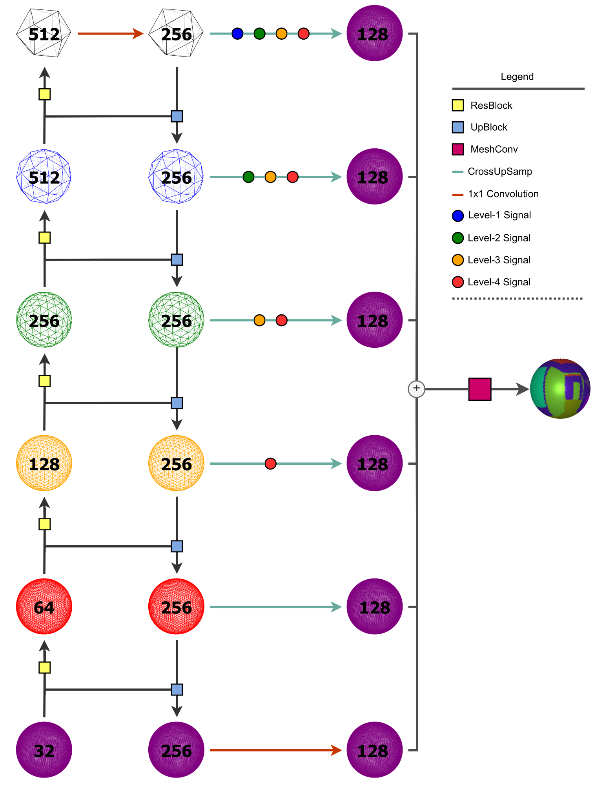

## S2FPN: Spherical Feature Pyramid Networks for Image Segmentation

### About
This repository provides the code for our research work *"Spherical Feature Pyramid Networks for Image Segmentation"*. Current approaches to spherical segmentation exclusively use variants of the UNet architecture, meaning more successful planar architectures remain unexplored. Inspired by the success of feature pyramid networks (FPNs) in planar image segmentation, in this work we leverage the pyramidal hierarchy of graph-based spherical CNNs to design spherical FPNs (S2FPN). Our S2FPN
models show consistent improvements over spherical UNets, whilst using fewer parameters. On the Stanford 2D3DS dataset, our FPN models set the new state of the art, wih an mIoU of 48.75.

### Acknowledgement
We are grateful to Jiang et al for their [UGSCNN](https://github.com/maxjiang93/ugscnn) code base. Much of the code in this repository extends their work.
